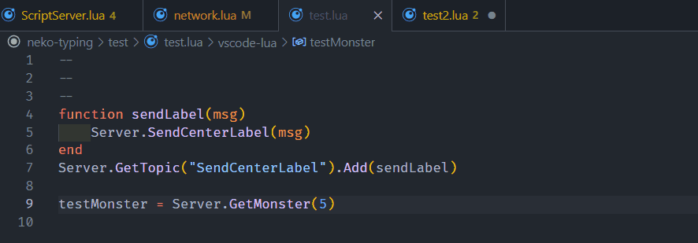

# neko-typing(Test)
>네코랜드 docs의 자동완성기능과 툴팁을 제공합니다.
## 설치방법
***필수:***

git 설치: http://git-scm.com/download/win

vscode 설치: https://code.visualstudio.com/download

***step 1***: 설치 후 사용할 프로젝트에서 다음과 같이 입력
```
git clone https://github.com/vin-spiegel/neko-typing.git
```
***step 2***: vscode Extension 마켓에서 Lua Language Server 설치

설치 링크: https://marketplace.visualstudio.com/items?itemName=sumneko.lua


<!-- ***step 3***: 메뉴>파일> 기본설정> 사용자 코드조각> lua 언어로 snippets생성 > 다운받은 .vscode폴더파일 붙혀넣기 -->

## 미리보기
**자동완성**


**툴팁**


